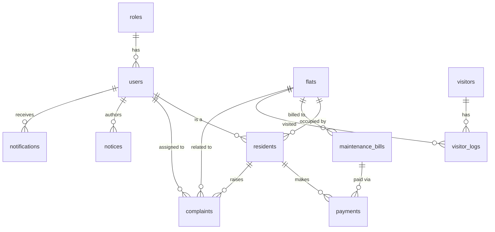

# Entity Relationship Diagram

The database schema is normalized to 3NF and organized into the following primary entities:

## Core Entities
- **roles**: Defines RBAC roles (ADMIN, RESIDENT, SECURITY).
- **users**: Authentication data mapped to roles.
- **flats**: Physical residential units.
- **residents**: Resident details linked to users and flats.

## Billing System
- **maintenance_bills**: Monthly generated bills for flats.
- **payments**: Payment transactions mapped to bills and residents.

## Visitor Management
- **visitors**: Unique visitor details.
- **visitor_logs**: Visits mapping visitors to flats over time.

## Support & Communication
- **complaints**: Support tickets raised by residents.
- **notices**: Announcements published by admins.
- **notifications**: System notifications for users.

## ER Diagram (Text Representation)

